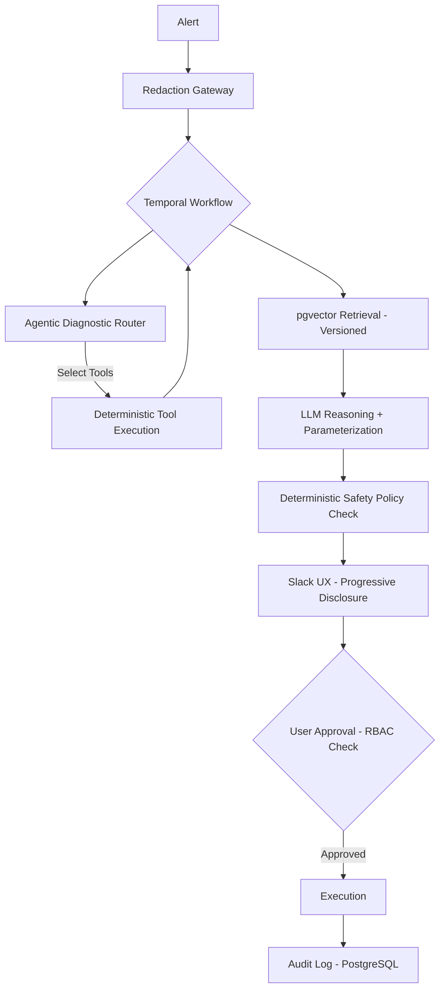

# ADR-001: AI-Integrated Incident Response System

**Status:** Draft (Revised per LLM Council Review)
**Date:** 2025-12-12
**Decision Makers:** Engineering, Platform, Security, Compliance

---

## Context

We have comprehensive runbooks (e.g., 2,600-line SQL Server Deadlock Guide) that engineers must manually navigate during incidents. We want to transform these into an **interactive, AI-assisted system** where:

1. Alerts automatically trigger triage using codified decision trees
2. Diagnostic data is collected automatically via deterministic tool execution
3. LLMs identify patterns via RAG over indexed runbook documentation
4. Results appear in Slack with interactive remediation options
5. Risky actions require human approval; safe actions auto-execute

---

## Decision

### Proposed Architecture

```
Alert → Redaction Gateway → Orchestrator (Temporal) → Agentic Diagnostic Router
    → Deterministic Tool Execution → LLM+RAG Analysis → Safety Policy Check
    → Slack UX (Progressive Disclosure) → Approval Workflow (RBAC) → Action Execution
```

### Hybrid Deterministic/Probabilistic Boundary

| Component | Approach | Rationale |
|-----------|----------|-----------|
| **Severity classification** | Strict Deterministic | LLM can advise UP but never downgrade severity |
| **Escalation decisions** | Deterministic | Must be auditable and traceable |
| **SLA enforcement** | Deterministic | Regulatory requirement |
| **Diagnostic tool selection** | Agentic Router (Constrained) | LLM selects from allowlist of tools; never generates raw SQL/queries |
| **Diagnostic execution** | Deterministic | Code executes the selected tools |
| **Confidence computation** | Deterministic | Computed from RAG scores + heuristics, not LLM output |
| **Pattern identification** | LLM + RAG | Grounded in runbook content |
| **Root cause explanation** | LLM + RAG | Low-risk, high-value use case |
| **Action parameterization** | LLM proposes → Deterministic validates | Schema validation, bounds checking before human review |
| **Action authorization** | Deterministic | Risk-tier based approval policies |
| **Conversational Q&A** | LLM with guardrails | Treat all log data as untrusted content |

### Revised Tech Stack

| Component | Original | Revised | Rationale |
|-----------|----------|---------|-----------|
| **Orchestration** | n8n | **Temporal.io** | Durable execution, audit trail, workflow-as-code, git-backed logic |
| **Vector DB** | Qdrant | **pgvector** | Consolidates on existing PostgreSQL; transactional consistency; simpler compliance |
| **LLM** | Claude API | Claude API + Self-hosted fallback | Primary/fallback/emergency modes |
| **Chat** | Slack Bolt | Slack Bolt | No change |
| **Audit** | PostgreSQL | PostgreSQL | No change |

---

## Data Sanitization Pipeline

**Critical for Financial Services**: All data must pass through a redaction gateway before reaching external LLM APIs.

```
Raw Alert/Diagnostics
        ↓
┌───────────────────────────────────────┐
│         REDACTION GATEWAY             │
├───────────────────────────────────────┤
│ 1. Regex/NER → Detect PII/MNPI        │
│ 2. Tokenize Account Numbers           │
│ 3. Redact Customer Names              │
│ 4. Scan for Secrets/Credentials       │
│ 5. Log Redaction Actions              │
└───────────────────────────────────────┘
        ↓
   Sanitized Data → LLM API
```

**Note**: Token maps for customer IDs must be session-scoped and non-persistent.

---

## Failure Modes & Mitigations

| Risk | Description | Mitigation |
|------|-------------|------------|
| **LLM hallucination** | Fabricated patterns or recommendations | RAG grounding, confidence computed deterministically, human review |
| **Feedback loop amplification** | Remediation triggers new alert, causing loop | Idempotency keys, cooldown periods per resource, circuit breakers |
| **Alert storms** | High-velocity incidents overwhelm system | Deduplication, rate limiting, graceful degradation |
| **RBAC privilege escalation** | Bot has admin access; junior user exploits it | **RBAC Passthrough**: verify triggering user's permissions, not bot's |
| **Context window exhaustion** | Large logs/traces exceed LLM context limits | Deterministic "Log Crusher" (summarizer/filter) before LLM |
| **False reassurance** | LLM confidently misdiagnoses P1 as transient | Aggressive disclaimers on low-confidence outputs; LLM never downgrades severity |
| **Stale embeddings** | Runbook changes not reflected in RAG | Event-driven sync, version-aware retrieval, freshness warnings |
| **Prompt injection** | Malicious content in logs/alerts | Treat all log data as untrusted; structured tool calling with ACLs |
| **Multi-incident interference** | Concurrent incidents share context | Strict session isolation; incident ID scoping for all state |
| **Confidence miscalibration** | 92% doesn't mean 92% accuracy | Calibration monitoring; track confidence vs outcome correlation |
| **Approval fatigue** | Too many requests → rubber-stamping | Approval budgeting; escalation if approval rate exceeds threshold |
| **Model drift** | LLM behavior changes without warning | Pin model versions; regression test prompts; staging validation |
| **API unavailability** | LLM provider outage | Self-hosted fallback (Llama 3); deterministic-only emergency mode |
| **Compliance gaps** | Missing audit trail | Full chain logging: input → retrieval → reasoning → approval → execution |
| **Change window violations** | Actions suggested outside approved windows | Calendar-aware action filtering; deterministic freeze enforcement |

---

## Enterprise & Compliance (Financial Services)

### Regulatory Framework

| Requirement | Implementation |
|-------------|----------------|
| **Model Risk Management (SR 11-7)** | Treat system as a "model"; independent validation, performance monitoring, drift detection |
| **SOX** | Tamper-evident audit logging; change management trail |
| **Data Residency (GDPR)** | Confirm zero-day retention; region-pinned LLM API; self-hosted option |
| **Right to Explanation** | Log full reasoning chain; surface evidence to users |
| **Separation of Duties** | Same person cannot propose AND approve high-risk changes |

### Required Documentation

1. **Model Card**: Claude's role, limitations, failure modes
2. **Data Flow Diagram**: Exactly what data reaches external APIs
3. **Rollback Procedure**: How to disable AI and operate manually
4. **Validation Report**: Evidence that LLM suggestions align with runbooks

### Vendor Governance

- DPAs/BAAs, SOC2/ISO 27001 evidence for LLM provider
- Explicit contracts: no training on data, retention policies, subprocessors
- Multi-LLM fallback strategy documented

---

## Trust & Adoption: UX Design

### Design Principles

#### 1. Citations Are Mandatory
Never show a suggestion without a source link:
```
🔧 Recommended: Create Index
   [Source: SQL Server Deadlock Guide, Section 4.2]
```

#### 2. Progressive Disclosure of Confidence
Show *why*, not just the score:
```
📊 Pattern: Key Lookup Deadlock (92% match)
   ├── Wait type MATCH: LCK_M_X ✓
   ├── Object pattern MATCH: Clustered index + nonclustered seek ✓
   ├── Frequency PARTIAL: 7/15min (typical: 5-20/15min) ⚠️
   └── Source: "SQL Server Deadlock Guide" §4.2.1 [View Context]
```

#### 3. Show Your Work
Collapsible section revealing raw log lines and runbook chunks used.

#### 4. Graceful Degradation
When uncertain, say so:
```
🤔 Low confidence analysis (61%)

Closest patterns:
- Key Lookup Deadlock (61% match) - missing typical wait type
- Lock Escalation (58% match) - frequency doesn't fit

Recommended: Manual runbook review
[Open Deadlock Guide] [Open Lock Escalation Guide]
```

#### 5. Disagreement Loop
```
[👍 Helpful] [👎 Wrong] [🔄 Partially Right]

If wrong: [Suggest correction...] → triggers review ticket + feeds evaluation dataset
```

#### 6. Latency Masking
Stream status updates in Slack:
```
[10:00:01] Analyzing alert...
[10:00:03] Fetching logs from Splunk...
[10:00:08] Consulting Runbooks...
[10:00:12] Final Analysis:
```

### Adoption Phases

| Phase | Duration | Scope | Success Criteria |
|-------|----------|-------|------------------|
| **Shadow** | 4 weeks | System suggests; humans act independently | <20% disagreement rate |
| **Advisory** | 8 weeks | Suggestions shown; humans decide | >80% rated helpful |
| **Assisted** | Ongoing | Auto-collection; human-approved actions | MTTR improvement measurable |
| **Autonomous** | After 6mo+ | Pre-approved safe actions auto-execute | Zero incidents caused by automation |

---

## Runbook Synchronization Strategy

### Architecture: Event-Driven Sync

```
┌─────────────────┐     ┌──────────────────┐     ┌─────────────────┐
│   Runbook Repo  │────▶│   Git Webhook    │────▶│  Embedding      │
│   (Markdown)    │     │   or CI Trigger  │     │  Pipeline       │
└─────────────────┘     └──────────────────┘     └────────┬────────┘
                                                          │
                              ┌────────────────────────────┤
                              ▼                            ▼
                    ┌─────────────────┐          ┌─────────────────┐
                    │  Chunk Differ   │          │  Full Reindex   │
                    │  (incremental)  │          │  (nightly)      │
                    └────────┬────────┘          └────────┬────────┘
                              │                            │
                              ▼                            ▼
                    ┌──────────────────────────────────────────────┐
                    │         pgvector (Versioned Namespaces)      │
                    └──────────────────────────────────────────────┘
```

### Implementation

1. **Source of Truth**: Runbooks in Git (Markdown) with structured headings
2. **Event-Driven**: Git push triggers CI → chunk → embed → atomic upsert
3. **Version-Aware**: Metadata includes commit SHA; warn if chunk >6 months old
4. **Conflict Detection**: Flag contradictory guidance from different runbooks
5. **Nightly Safety Net**: Full reindex with atomic namespace swap

### Freshness Warning
```
⚠️ Warning: This documentation may be outdated (last update: Jan 2023). Verify manually.
```

---

## Example Interaction (Revised)

```
🟠 DEADLOCK ALERT - P2 HIGH
Frequency: 7/15min | Impact: 42 failed requests | DB: PROD-SQL-01

📊 Pattern: Key Lookup Deadlock (92% match)
   ├── Wait type: LCK_M_X ✓
   ├── Object: Clustered + nonclustered seek ✓
   └── [Source: SQL Deadlock Guide §4.2]

🔧 Recommended: CREATE INDEX ... INCLUDE (...)
   [Validated: Schema ✓ | Naming ✓ | Size ✓]

[View XML] [Show Evidence] [Create JIRA] [Request Index Creation]

User: "Why now?"
Bot: "Traffic increased 40% at 11:45. Index adequate at normal load
     but bottlenecks under concurrency. [Source: §4.2.3]"

User: [Clicks Request Index Creation]
Bot: "⚠️ Requires DBA approval. Checking permissions..."
Bot: "✓ @alice has DBA-ONCALL role. @alice [Approve] [Deny]"
```

---

## Architecture Diagram



---

## Interactive Runbooks: Advanced UX Vision

*Council Review: 2025-12-13*

### The Concept

Beyond Slack-based interactions, the council evaluated a more ambitious UX pattern: **Interactive Runbooks** combining:
- **Google Colab**: Executable cells, live code, prefilled outputs
- **NotebookLM**: AI that deeply understands document context
- **Slack**: Real-time collaboration, threading, @mentions
- **Google Cloud Operational Docs**: Structured troubleshooting with decision trees

### Council Verdict

**The vision is the correct direction for incident response.** The industry is moving from static wikis toward unified, executable surfaces. However, the engineering challenges of **state management** and **trust calibration** are the actual hurdles—not LLM capabilities.

### Feasibility Assessment

| Challenge | Difficulty | Solution |
|-----------|------------|----------|
| Pre-filling context | Easy | API integrations to monitoring stack |
| Natural language queries | Medium | RAG over runbooks + tool-calling LLM |
| Multi-player state sync | **Hard** | CRDTs for text; kernel state requires distributed systems work |
| Context stuffing | **Hard** | LLM writes queries (SQL/PromQL), doesn't analyze raw data |
| Latency budgets | **Hard** | Sub-5s responses required; async loading with "fade-in" insights |

**Key Insight**: The LLM should never analyze raw logs directly. It should write the SQL/PromQL to query your observability platforms. Feasibility hinges on how well you index existing tools.

### Cognitive Load: The "Dashboard of Everything" Trap

**Risk**: Creating a surface so dense with chat, cells, logs, and AI suggestions that it paralyzes responders.

**Mitigation: Progressive Disclosure**

```
┌─────────────────────────────────────────────────────────────────┐
│                    INTERACTIVE RUNBOOK                          │
├─────────────────────────────────────────────────────────────────┤
│  LEFT: Navigation / Phases                                      │
│        [Detect] → [Triage] → [Mitigate] → [Verify]             │
├─────────────────────────────────────────────────────────────────┤
│  CENTER: Runbook Steps (The "Spine")                           │
│          - Primary view, always visible                         │
│          - AI insights collapsed by default                     │
├─────────────────────────────────────────────────────────────────┤
│  RIGHT: Chat / Threads / AI                                     │
│         - Pull-based (user asks) not push-based (popups)       │
├─────────────────────────────────────────────────────────────────┤
│  BOTTOM: Facts Panel                                            │
│          - Key metrics snapshot                                 │
│          - Current alerts                                       │
│          - Recent deploys                                       │
└─────────────────────────────────────────────────────────────────┘
```

**Mode Separation**: Distinctly separate "Triage Mode" (Is it real? Where's the fire?) from "Forensics Mode" (deep dive analysis).

### Expert Agent Delegation: Hub-and-Spoke Architecture

```
┌─────────────────────────────────────────────────────────────────┐
│                     Interactive Runbook UI                      │
├─────────────────────────────────────────────────────────────────┤
│                      Orchestration Layer                        │
│  ┌─────────────┐  ┌─────────────┐  ┌─────────────────────────┐ │
│  │   Router    │──│  Context    │──│  Response Synthesizer   │ │
│  │   Agent     │  │  Manager    │  │  (combines agent outputs)│ │
│  └─────────────┘  └─────────────┘  └─────────────────────────┘ │
├─────────────────────────────────────────────────────────────────┤
│                      Expert Agent Pool                          │
│  ┌──────────┐ ┌──────────┐ ┌──────────┐ ┌──────────┐          │
│  │ Database │ │ Network  │ │Kubernetes│ │ Service  │   ...    │
│  │ Agent    │ │ Agent    │ │ Agent    │ │ X Agent  │          │
│  └────┬─────┘ └────┬─────┘ └────┬─────┘ └────┬─────┘          │
│       │            │            │            │                  │
├───────┴────────────┴────────────┴────────────┴──────────────────┤
│                    Retrieval & Tool Layer                       │
│  ┌──────────┐ ┌──────────┐ ┌──────────┐ ┌──────────┐          │
│  │ Runbook  │ │ Metrics  │ │   Logs   │ │  Change  │   ...    │
│  │ Corpus   │ │   APIs   │ │   APIs   │ │  History │          │
│  └──────────┘ └──────────┘ └──────────┘ └──────────┘          │
└─────────────────────────────────────────────────────────────────┘
```

**Agent Design Principles**:
- **Specialized retrieval**: DB agent queries DBA wiki, schemas, past DB incidents
- **Specialized tools**: DB agent can run `EXPLAIN ANALYZE`; network agent can run `traceroute`
- **Calibrated confidence**: Each agent knows its boundaries
- **Plan + Action output**: Agents generate text plans AND code blocks for human review

**Critical**: Agents should not see other agents' interpretations—only facts—to avoid echo chambers.

### Trust Calibration: The Friction/Risk Matrix

|                    | Low Impact           | High Impact                    |
|--------------------|----------------------|--------------------------------|
| **High Confidence** | Auto-execute         | One-click + confirm           |
| **Low Confidence**  | One-click            | Requires explanation + manager approval |

**Adversarial Onboarding**: Training modules where AI deliberately gives wrong answers to teach engineers to verify sources.

### Graceful Degradation

**Principle**: The system must be useful even if the "Brain" is lobotomized.

**The "Markdown + Terminal" Fallback**:
```
┌─────────────────────────────────────────────────────┐
│  AI Status: ⚠️ Degraded                             │
│  ───────────────────────────────────────────────── │
│  • AI chat: Unavailable                             │
│  • Pre-filled context: Working (cached)             │
│  • Executable cells: Working                        │
│  • Expert agents: Unavailable                       │
│                                                     │
│  [Continue with manual runbook] [Retry AI services] │
└─────────────────────────────────────────────────────┘
```

The runbook itself—structured steps, documentation, executable cells—must work without AI. AI is an enhancement, not a dependency.

### Prior Art & Lessons

| Tool | Lesson |
|------|--------|
| **Fiberplane** | Collaborative SRE notebooks work; nailed provider integration |
| **Shoreline/RunOps** | Executable notebooks often stuck as post-mortem tools—too slow to set up during fires |
| **NotebookLM** | Document-grounded Q&A reduces hallucinations |
| **Incident.io/FireHydrant** | Slack-native beats custom UI for adoption |

**The "Start State" Insight**: If an engineer opens the tool and relevant metrics are *already queried and visualized* in Cell 1, you've won. This removes "blank canvas paralysis."

### Simplified 80/20 Alternative: The Smart Launcher (Recommended V1)

If the full vision is too complex for V1:

**Concept**: Alert fires → System generates a static document with:
- Pre-filled metrics and relevant runbook sections
- Simple "Chat with this doc" sidebar
- No executable state management

**Value**: 70% of the benefit with 20% of the engineering risk.

```
┌─────────────────────────────────────────────────────────────────┐
│  INCIDENT: Deadlock Alert on PROD-SQL-01                       │
├─────────────────────────────────────────────────────────────────┤
│  📊 METRICS (auto-populated)                                    │
│  ┌─────────────────────────────────────────────────────────┐   │
│  │ [Live Grafana Embed: Connection Pool Saturation]        │   │
│  │ [Live Grafana Embed: Query Latency P99]                 │   │
│  └─────────────────────────────────────────────────────────┘   │
├─────────────────────────────────────────────────────────────────┤
│  📖 RELEVANT RUNBOOK SECTIONS                                   │
│  • SQL Server Deadlock Guide §4.2 - Key Lookup Patterns        │
│  • Index Optimization Strategies §2.1                          │
├─────────────────────────────────────────────────────────────────┤
│  💬 CHAT WITH THIS DOC                      [Collapse ▼]       │
│  ┌─────────────────────────────────────────────────────────┐   │
│  │ You: "Does this match the pattern from last week?"      │   │
│  │ AI: "Yes, similar symptoms. Last week resolved with..." │   │
│  └─────────────────────────────────────────────────────────┘   │
└─────────────────────────────────────────────────────────────────┘
```

### Implementation Phases for Interactive Runbooks

| Phase | Focus | Scope |
|-------|-------|-------|
| **V1: Smart Launcher** | Pre-filled context + chat sidebar | Static docs, no execution |
| **V2: Safe Automation** | Executable read-only diagnostics | Buttons for queries, ticket creation |
| **V3: Notebooks** | Executable cells with RBAC | Per-team tested playbooks |
| **V4: Full Vision** | Multi-agent orchestration | Deep telemetry integration |

---

## Reconciling Human-in-the-Loop with Automated Remediation

*Council Review: 2025-12-13*

### The False Dichotomy

**Council Verdict**: The tension between HITL and automation is a false dichotomy. Design it as a **governed spectrum of autonomy**, not "Manual vs. Automated."

### The Autonomy Ladder

| Level | Mode | AI Role | Human Role |
|-------|------|---------|------------|
| **0** | Manual/Assisted | Diagnoses, suggests runbook | **Executor**: Types commands manually |
| **1** | Human-Gated | Prepares exact command, computes impact | **Approver**: Reviews and clicks "Execute" |
| **2** | Human-Supervised | Executes immediately, notifies human | **Supervisor**: Monitors, can abort |
| **3** | Bounded Autonomy | Executes within strict limits | **Reviewer**: Post-incident audit |
| **4** | Fully Autonomous | Self-healing when conditions met | **Governor**: Reviews aggregate metrics |

### The Automation Suitability Score

For each runbook action, score on 5 dimensions (1-5 scale):

| Dimension | Low (1) | High (5) |
|-----------|---------|----------|
| **Reversibility** | Data deletion | Stateless restart |
| **Blast Radius** | Entire region | Single pod |
| **Determinism** | "Model suspects anomaly" | "Disk full" |
| **Time Criticality** | Can wait hours | Seconds matter |
| **Regulatory Class** | Touches SOX scope | No regulatory concern |

**Decision Rule**:
- Score < 15: **Human-Executed** or **Human-Gated**
- Score 15-20: Candidate for **Human-Supervised**
- Score > 20: Candidate for **Fully Automated** (if regulatory allows)

### The "3am Problem" Solution

**Principle**: Pre-commitment policies made in daylight by stakeholders.

```
┌─────────────────────────────────────────────────────────────────┐
│                    3AM DECISION TREE                            │
├─────────────────────────────────────────────────────────────────┤
│  1. Attempt page → Try on-call engineering                      │
│                                                                 │
│  2. Check Service Tier:                                         │
│     • Tier 0 (Payment Rails): Default to FAIL-SAFE              │
│       → Accept degradation to preserve data integrity           │
│     • Tier 1+ (Non-critical): Default to FAIL-OPEN              │
│       → Prioritize availability                                 │
│                                                                 │
│  3. Emergency Logic:                                            │
│     IF (Cost_of_Downtime > Risk_Threshold)                      │
│        AND (Action is Reversible)                               │
│     THEN → Auto-Execute                                         │
│                                                                 │
│  Example: Restarting web server = OK                            │
│           Dropping database table = NEVER                       │
└─────────────────────────────────────────────────────────────────┘
```

### The Runbook's Role in an Automated World

In an automated world, the Interactive Runbook evolves from checklist to **Glass Cockpit**:

| Role | Description |
|------|-------------|
| **Glass Break Mechanism** | Manual override when automation fails or loops |
| **Context Preservation** | Shows evidence for human approval decisions |
| **Audit Artifact** | Immutable record for compliance—logs AI and human decisions |
| **Visibility Layer** | "I detected X, checked Y, executed Z" |

### Trust Accumulation: The Graduation Pipeline

Automation must be **earned, not built**.

```
┌─────────────────────────────────────────────────────────────────┐
│              THE TRUST GRADUATION PIPELINE                      │
├─────────────────────────────────────────────────────────────────┤
│                                                                 │
│  PHASE 1: Shadow Mode                                           │
│  └─ AI logs: "I would have executed X"                          │
│  └─ Human executes manually                                     │
│  └─ Requirement: 50 matching incidents                          │
│                           │                                     │
│                           ▼                                     │
│  PHASE 2: Recommendation (Human-Gated)                          │
│  └─ Runbook presents "Fix It" button                            │
│  └─ Human must click                                            │
│  └─ Requirement: 20 consecutive successes, 0 rollbacks          │
│                           │                                     │
│                           ▼                                     │
│  PHASE 3: Supervised Autonomy                                   │
│  └─ "Executing X in 60s unless you veto"                        │
│  └─ Requirement: 3 months stability                             │
│                           │                                     │
│                           ▼                                     │
│  PHASE 4: Full Autonomy                                         │
│  └─ Graduated by governance vote (Engineering + Risk)           │
│                                                                 │
│  ⚠️ DEMOTION TRIGGER: Any Sev-1 incident or rollback            │
│     → Immediate demotion to Phase 2                             │
└─────────────────────────────────────────────────────────────────┘
```

### Regulatory Constraints (Financial Services)

**The "Never Automate" List** (regardless of technical safety):

| Category | Examples | Reason |
|----------|----------|--------|
| **Money Movements** | Reversing transactions, ledger changes | Fiduciary duty |
| **Security Controls** | Disabling firewalls, IAM changes | Compliance requirement |
| **Model/Risk Parameters** | Trading limits, fraud thresholds | Regulatory oversight |
| **Data Deletion** | Purging records | Retention policies |

**Audit Requirement**: Logs must distinguish "System Initiated" vs "Human Initiated". For automated actions, the "Identity" is the approved runbook version.

### Avoiding the "Autopilot Paradox"

Aviation shows partial automation can be dangerous—humans become complacent.

**Anti-Complacency Measures**:

| Strategy | Implementation |
|----------|----------------|
| **Active Engagement** | Don't ask "Click OK"; ask "Confirm you checked Graph A and B" |
| **Game Days** | Monthly drills with automation disabled |
| **No Hidden Modes** | UI clearly shows "AUTO-PILOT ENGAGED" vs "MANUAL CONTROL" |
| **Prediction Exercises** | Before approval, ask: "What do you expect will happen?" |
| **Variable Autonomy** | Occasionally downgrade to Human-Gated for training |

### Integrated Decision Flow

```
┌─────────────────────────────────────────────────────────────────┐
│                    AUTOMATION DECISION FLOW                     │
├─────────────────────────────────────────────────────────────────┤
│                                                                 │
│  Incident Detected                                              │
│         │                                                       │
│         ▼                                                       │
│  ┌─────────────────────────────────────────────────────────┐   │
│  │ Calculate: Base Level + Context Modifiers + Regulatory  │   │
│  │            Constraints = Effective Automation Level     │   │
│  └─────────────────────────────────────────────────────────┘   │
│         │                                                       │
│    ┌────┴────┬────────────┐                                    │
│    ▼         ▼            ▼                                    │
│  FULL     SUPERVISED   APPROVED    MANUAL                      │
│  AUTO     (notify)     (click)     (human runs)                │
│    │         │            │            │                       │
│    └─────────┴────────────┴────────────┘                       │
│                    │                                            │
│                    ▼                                            │
│  ┌─────────────────────────────────────────────────────────┐   │
│  │ OUTCOME RECORDING                                        │   │
│  │ • Audit log (compliance)                                 │   │
│  │ • Update trust scores                                    │   │
│  │ • Feed graduation/demotion evaluation                    │   │
│  └─────────────────────────────────────────────────────────┘   │
│                                                                 │
└─────────────────────────────────────────────────────────────────┘
```

### Key Principles Summary

1. **The dichotomy is false** — HITL and automation are a spectrum, not opposites
2. **Level varies by action** — Different actions within same incident warrant different levels
3. **Trust is earned** — Actions graduate through automation levels based on evidence
4. **Context matters** — Same action may be automated in one context, require approval in another
5. **Compliance is non-negotiable** — Some actions require human approval regardless of technical safety
6. **Meaningful involvement** — Humans must be engaged meaningfully, not rubber-stamping
7. **Skills atrophy** — Active measures needed to maintain human capability

---

## Tier-2 Technical Decisions

*Council Review: 2025-12-13*

These decisions are required before implementation can begin. Each represents a design choice that affects multiple components.

### Decision Summary Table

| Area | Decision | Rationale |
|------|----------|-----------|
| **Runbook Storage** | GitOps Hybrid (Markdown + YAML) | Engineers prefer Git; Postgres for runtime queries |
| **Alert Ingestion** | Webhook Gateway + CloudEvents | Decouples sources from workflows; standard schema |
| **Diagnostic Tools** | Tooling Gateway (Typed Adapters) | Safety, RBAC passthrough, tool abstraction |
| **Prompt Engineering** | Git-managed Jinja2 Templates | Prompts are code; version control + evaluation |
| **Action Execution** | Temporal Activities + Registry | Durability, Saga pattern for rollback |
| **Approval Workflow** | Slack Block Kit + Middleware | Rich UI, identity verification, quorum support |
| **Embedding Pipeline** | Event-Driven (CI/CD trigger) | Freshness critical; transactional consistency |
| **Agent Orchestration** | Hierarchical Temporal Workflows | Deterministic boundary; isolates specialist failures |
| **Confidence Scoring** | Deterministic Ensemble | LLMs can't self-calibrate; explainable metrics |
| **Audit & Compliance** | Event Sourcing in Postgres | Structured traces; query-able decision history |

---

### 1. Runbook Authoring & Storage

**Decision**: Extended Markdown in Git with CI sync to PostgreSQL

```
┌────────────────────────────────────────────────────────────────┐
│  RUNBOOK LIFECYCLE                                             │
├────────────────────────────────────────────────────────────────┤
│                                                                │
│  Author (Engineer)                                             │
│       │                                                        │
│       ▼                                                        │
│  ┌─────────────┐                                               │
│  │  Markdown   │  - YAML frontmatter (metadata)                │
│  │  in Git     │  - Executable code blocks                     │
│  └──────┬──────┘                                               │
│         │ PR Review                                            │
│         ▼                                                      │
│  ┌─────────────┐                                               │
│  │  CI/CD      │  - Validate schema                            │
│  │  Pipeline   │  - Generate embeddings                        │
│  └──────┬──────┘  - Upsert to Postgres                         │
│         │                                                      │
│         ▼                                                      │
│  ┌─────────────┐     ┌─────────────┐                          │
│  │  runbooks   │     │  pgvector   │                          │
│  │  table      │     │  embeddings │                          │
│  └─────────────┘     └─────────────┘                          │
│                                                                │
└────────────────────────────────────────────────────────────────┘
```

**Requirements**:
- YAML frontmatter: `id`, `service_owner`, `autonomy_level`, `required_permissions`
- Executable steps: fenced blocks like ` ```action:restart_pod` `
- Version pinning: Runtime references specific Git SHA
- Validation: CI fails on schema violations

---

### 2. Alert Ingestion

**Decision**: Webhook Gateway normalizing to CloudEvents standard

**Common Alert Format (CAF) Schema**:
```yaml
alert:
  id: string              # UUID
  fingerprint: string     # Deduplication key
  source: string          # e.g., "prometheus", "datadog"
  severity: enum          # critical|high|medium|low|info
  service_id: string      # From service catalog
  title: string
  description: string
  labels: map
  fired_at: timestamp
  raw_payload: object     # Original for debugging
```

**Requirements**:
- Normalize all sources to CAF within 100ms p99
- Deduplication: 30-minute sliding window on fingerprint
- Enrich with service catalog metadata before workflow start
- Dead-letter failed ingestion with exponential backoff retry

---

### 3. Diagnostic Tool Integration

**Decision**: Tooling Gateway with strongly-typed adapters

```
┌────────────────────────────────────────────────────────────────┐
│  TOOLING GATEWAY                                               │
├────────────────────────────────────────────────────────────────┤
│                                                                │
│  Workflow/Agent                                                │
│       │                                                        │
│       │ get_cpu_metrics(service, window)                       │
│       ▼                                                        │
│  ┌─────────────────────────────────────────────────────────┐  │
│  │              TOOLING GATEWAY SERVICE                     │  │
│  │  ┌──────────┐ ┌──────────┐ ┌──────────┐ ┌──────────┐   │  │
│  │  │  Auth    │ │  Rate    │ │ Timeout  │ │ Redact   │   │  │
│  │  │  RBAC    │→│  Limit   │→│ Circuit  │→│ Output   │   │  │
│  │  └──────────┘ └──────────┘ └──────────┘ └──────────┘   │  │
│  └─────────────────────────────────────────────────────────┘  │
│       │                                                        │
│       ├───────────────┬───────────────┬───────────────┐       │
│       ▼               ▼               ▼               ▼       │
│  ┌──────────┐   ┌──────────┐   ┌──────────┐   ┌──────────┐   │
│  │Prometheus│   │ Splunk   │   │ Datadog  │   │   K8s    │   │
│  │ Adapter  │   │ Adapter  │   │ Adapter  │   │ Adapter  │   │
│  └──────────┘   └──────────┘   └──────────┘   └──────────┘   │
│                                                                │
└────────────────────────────────────────────────────────────────┘
```

**Requirements**:
- Each tool: defined input/output schema (Pydantic)
- Circuit breakers: 30s timeout, 1MB max result
- Credentials: HashiCorp Vault with dynamic secrets
- RBAC passthrough: impersonation token per request

---

### 4. LLM Prompt Engineering

**Decision**: Git-managed Jinja2 templates with evaluation suite

**Requirements**:
- Prompts versioned in Git alongside runbooks
- CI runs evaluation suite against historical incidents
- Supports Chain-of-Thought structure enforcement
- Dynamic tool injection based on user RBAC
- Rollout via feature flags (percentage-based)

**Prompt Structure**:
```yaml
prompt:
  id: incident.diagnose
  version: "2.3.0"
  input_schema: { ... }
  output_schema: { ... }    # JSON schema for structured output
  template: |
    You are an SRE assistant...
    {{alert | format_alert}}
    ...
  evaluation:
    test_cases: [...]
    regression_baseline: "2.2.0"
```

---

### 5. Action Execution Engine

**Decision**: Temporal Activities with Action Registry (Saga pattern)

**Action Registry Entry**:
```yaml
action:
  id: k8s.deployment.restart
  risk_level: medium
  permissions_required: [k8s:deployments:update]
  blast_radius:
    max_affected_pods: 100
    requires_approval_above: 50
  rollback_handler: k8s.deployment.rollback
  dry_run_support: true
  idempotent: true
```

**Requirements**:
- Every action registered with declared capabilities/risks
- Dry-run mode for preview before execution
- Saga pattern: compensating action for rollback
- Blast radius limits enforced
- All executions logged with correlation IDs

---

### 6. Approval Workflow

**Decision**: Slack Block Kit with middleware identity verification

**Flow**:
```
Action Requires Approval
         │
         ▼
┌─────────────────────────────────────────┐
│  Slack Approval Card                    │
│  ┌───────────────────────────────────┐  │
│  │ 🔐 Approval Required              │  │
│  │ Action: Restart deployment        │  │
│  │ Risk: ⚠️ Medium                   │  │
│  │ Impact: 12 pods affected          │  │
│  │ Expires: 30 minutes               │  │
│  │                                   │  │
│  │ [✅ Approve] [❌ Reject] [Details] │  │
│  └───────────────────────────────────┘  │
└─────────────────────────────────────────┘
         │
         │ User clicks
         ▼
┌─────────────────────────────────────────┐
│  Middleware Service                     │
│  - Resolve Slack ID → Corporate ID      │
│  - Verify RBAC permissions              │
│  - Check quorum (if multi-party)        │
│  - Signal Temporal workflow             │
└─────────────────────────────────────────┘
```

**Requirements**:
- Approvals expire after configurable timeout (default 30min)
- Multi-party quorum support (e.g., "2 SREs required")
- High-risk actions require modal confirmation (not just button)
- All decisions logged with user ID, timestamp, rationale

---

### 7. Embedding Pipeline

**Decision**: Event-driven CI/CD pipeline on Git merge

**Requirements**:
- Trigger on `git merge` to main branch
- Semantic chunking by Markdown headers (not token count)
- Metadata tags: `runbook_version`, `service_tags`
- Transactional upsert (delete old + insert new atomically)
- Content hash to skip unchanged chunks

---

### 8. Agent Orchestration

**Decision**: Hierarchical Temporal Child Workflows

```
┌────────────────────────────────────────────────────────────────┐
│  AGENT ORCHESTRATION                                           │
├────────────────────────────────────────────────────────────────┤
│                                                                │
│                  ┌─────────────────────┐                       │
│                  │ Coordinator Workflow │                       │
│                  │ (Incident Lifecycle) │                       │
│                  └──────────┬──────────┘                       │
│                             │                                  │
│        ┌────────────────────┼────────────────────┐            │
│        ▼                    ▼                    ▼            │
│  ┌───────────┐       ┌───────────┐       ┌───────────┐       │
│  │ Database  │       │ Network   │       │ K8s       │       │
│  │ Agent     │       │ Agent     │       │ Agent     │       │
│  │ (Child)   │       │ (Child)   │       │ (Child)   │       │
│  └─────┬─────┘       └─────┬─────┘       └─────┬─────┘       │
│        │                   │                   │              │
│        │                   │                   │              │
│        ▼                   ▼                   ▼              │
│   DB Tools only      Network Tools      K8s Tools only       │
│   (scoped access)    only               (scoped access)      │
│                                                                │
└────────────────────────────────────────────────────────────────┘
```

**Requirements**:
- Shared `IncidentContext` object (read-only to children)
- Scoped tool access per specialist
- Time-boxing: 5-minute max before yield to coordinator
- Structured output format (not free-form chat)

---

### 9. Confidence Scoring

**Decision**: Deterministic ensemble (not LLM self-assessment)

**Formula**:
```
Confidence = (w1 × VectorScore)
           + (w2 × PreconditionCheck)
           + (w3 × HistoricalSuccessRate)
           - (Penalty × HedgingWordsDetected)
```

**Requirements**:
- Explainable: UI shows WHY confidence is low
- Configurable thresholds per service tier
- Drives autonomy ladder: Score < 0.7 → Human-Gated
- Negative signals: "maybe", "unclear", missing data → reduce score

---

### 10. Audit & Compliance

**Decision**: Structured Event Sourcing in PostgreSQL

**Schema**:
```sql
CREATE TABLE audit_events (
    trace_id        UUID PRIMARY KEY,
    incident_id     UUID REFERENCES incidents(id),
    event_type      VARCHAR(50),  -- 'llm_call', 'action_executed', 'approval'
    actor           VARCHAR(100), -- user_id or 'system:bot'
    action          TEXT,
    rationale       TEXT,         -- LLM reasoning (redacted)
    prompt_version  VARCHAR(20),
    parameters      JSONB,        -- redacted
    outcome         VARCHAR(20),
    timestamp       TIMESTAMPTZ,

    -- Partitioned by month for performance
) PARTITION BY RANGE (timestamp);
```

**Requirements**:
- PII redaction BEFORE insertion
- Immutable: no UPDATE/DELETE permissions
- Hot storage: 90 days in Postgres
- Cold archive: S3 (Parquet) for 7 years
- Query: "How often did users reject DB restart proposals?"

---

## Questions for the Team

1. What's our current runbook storage? (Git/Confluence/Wiki)
2. What's our change management window policy?
3. Do we have existing Model Risk Management processes?
4. What's our tolerance for external API dependency?
5. How many concurrent incidents typically occur?

---

## Decision Outcome

**Approved with conditions**: Implementation to proceed with revised architecture pending:
- [ ] Security review of redaction gateway
- [ ] Compliance sign-off on audit logging approach
- [ ] Platform approval of Temporal infrastructure
- [ ] Pilot scope definition (which runbooks/alert types first)

---

## References

- SR 11-7: Model Risk Management Guidance
- OWASP LLM Top 10
- Temporal.io Documentation
- pgvector Extension Documentation

---

*This ADR was revised based on feedback from the LLM Council (GPT-5.1, Gemini 3 Pro, Claude Opus 4.5, Grok 4) on 2025-12-12.*
